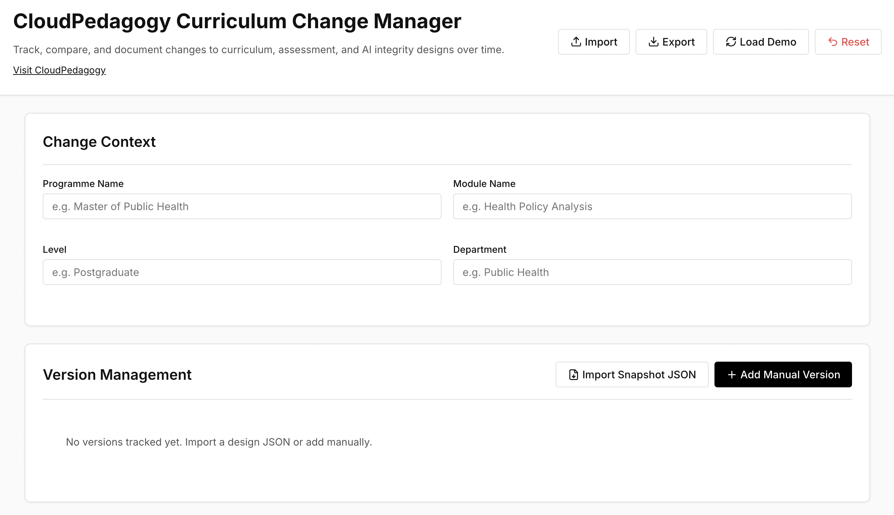

# Curriculum Change Manager

A local-first tool for tracking, comparing, and documenting changes to curriculum, assessment, and AI integrity designs over time.

🌐 **Live Hosted Version**  
http://cloudpedagogy-curriculum-change-manager.s3-website.eu-west-2.amazonaws.com/

🖼️ **Screenshot**  

---

## 🔗 Role in the CloudPedagogy Ecosystem

**Phase:** Phase 6 — Evidence, Quality & Change  

**Role:**  
Tracks curriculum and assessment changes over time, enabling structured comparison, rationale capture, and audit-ready change documentation.

**Upstream Inputs:**  
- Outputs from Assessment Design Engine  
- Outputs from AI Integrity Design Tool  
- Evidence packs and curriculum designs  

**Downstream Outputs:**  
- Structured change summaries for QA and governance  
- Inputs for institutional review and audit processes  

**Does NOT:**  
- Design curriculum or assessments  
- Generate full evidence packs  
- Perform curriculum mapping  

---

## Overview

The **Curriculum Change Manager** introduces versioning and auditability into academic design processes.

It enables educators, programme teams, and institutions to:
- track changes across versions of curriculum and assessment design  
- compare versions in a structured, readable format  
- document rationale, impact, and context for change  
- support QA, accreditation, and governance processes  

This helps ensure that change is:
- transparent  
- justified  
- traceable  
- aligned with institutional expectations  

---

## Key Features

- **Version Tracking**  
  Store multiple versions of curriculum or assessment designs  

- **Structured Comparison**  
  Compare versions side-by-side in a human-readable format  

- **Change Log & Rationale**  
  Record why changes were made and their impact  

- **Audit-Ready Outputs**  
  Generate structured summaries suitable for QA and review  

---

## Additional Documentation

- [User Instructions](./INSTRUCTIONS.md)
- [Project Specification](./PROJECT_SPEC.md)

---

## Technical Overview

- Built with TypeScript + Vite (React)  
- Fully local-first — runs entirely in the browser  
- Uses localStorage for persistence  
- Supports JSON import/export  
- No backend or external data storage  

---

## Run Locally

npm install  
npm run dev  

---

## Build

npm run build  

---

## Design Principles

- Local-first and inspectable  
- Governance-aware by design  
- Structured, not automated decision-making  
- Supports human judgement rather than replacing it  

---

## Disclaimer

This repository contains exploratory, framework-aligned tools developed for reflection, learning, and discussion.

These tools are provided as-is and are not production systems, audits, or compliance instruments. Outputs are indicative only and should be interpreted using professional judgement.

- All applications run locally in the browser  
- No user data is collected, stored, or transmitted  
- All example data is synthetic and does not represent real institutions or programmes  

---

## About CloudPedagogy

CloudPedagogy develops open, governance-credible tools for building confident, responsible AI capability across education, research, and public service.

- Website: https://www.cloudpedagogy.com/  
- Framework: https://github.com/cloudpedagogy/cloudpedagogy-ai-capability-framework  

---

## Capability and Governance

This tool supports both AI capability development and lightweight governance.

- Capability is developed through structured interaction with real workflows
- Governance is supported through optional fields that make assumptions, risks, and decisions visible

All governance inputs are optional and designed to support — not constrain — professional judgement.
